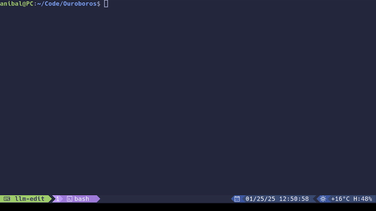

# LLM Edit

[](https://pypi.org/project/llm-edit/)
[](https://github.com/ajac-zero/llm-edit/blob/main/LICENSE)
[](https://github.com/astral-sh/uv)

Use LLMs to generate and edit files in your shell

This is a plugin for [llm](https://github.com/simonw/llm),
a command line interface for both local and remote large language models.

<p align="center">
  
</p>

<p align="center">
  <em>Asking llama-3.1-8b to generate a new file to solve fizzbuzz</em>
</p>

## Description

`llm edit` is a command line tool to edit files using large language models.
It allows users to provide a model with a file, context, and instructions to
generate or modify the file on your behalf.

## Usage Guide

```bash
# Install the tool
llm install llm-edit

# Edit a file
llm edit fizzbuzz.py create a program that solves fizzbuzz on an input number

# Add additional context files with -C
llm edit -C fizzbuzz.py fizzbuzz.js rewrite the program in js, dont use prompt

# Use any model within the `llm` ecosystem with -m
llm edit -m deepseek-v3 guide.md Write a guide on how to finetune a LLM
```

## Help

```bash
# To see the CLI docs, run:
llm edit --help
```

## Acknowledgments

This project would not be possible without the `llm` library and its creator, [Simon Willison](https://simonwillison.net/).

## License

This project is licensed under the Apache License, Version 2.0.
